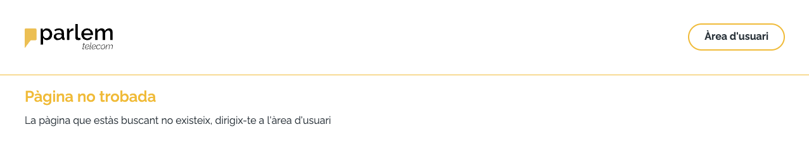
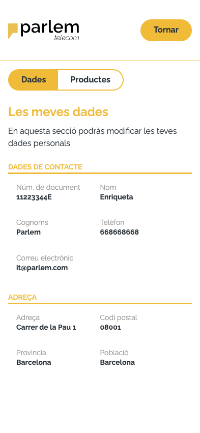
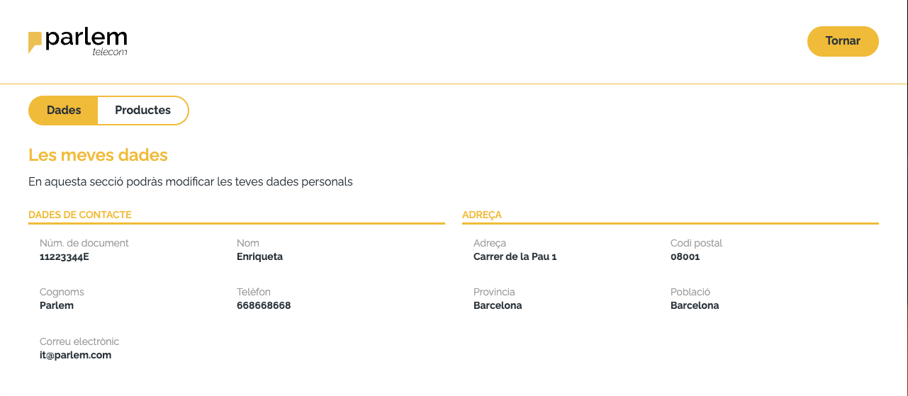
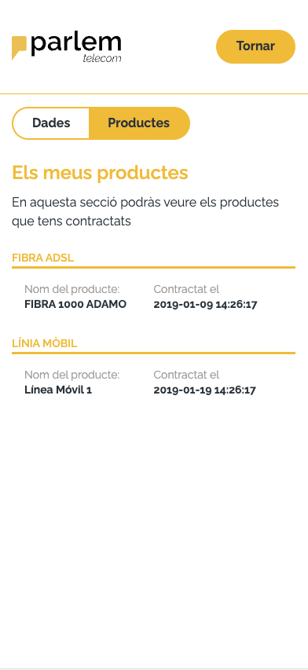
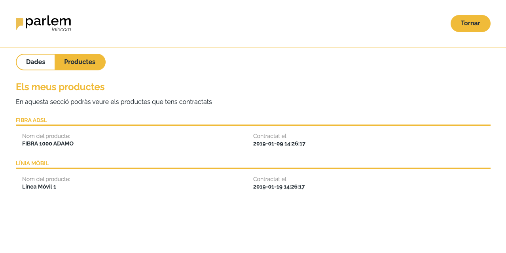

# Technical test

Made with turborepo, nuxt3, typescript

The app is connected to sonar for code quality validation

[SonarCloud validation](https://sonarcloud.io/project/overview?id=Jocalu_parlem-test)

## What's inside?

This turborepo uses [pnpm](https://pnpm.io) as a package manager. It includes the following packages/apps:

### Apps and Packages

- `parlem-web`: a [Nuxt.js](https://nuxt.com/) app
- `server`: a [Express.js](https://expressjs.com/) app
- `eslint-config-custom`: `eslint` configurations (includes `eslint-config-prettier`)

### Utilities

This turborepo has some additional tools already setup for you:

- [TypeScript](https://www.typescriptlang.org/) for static type checking
- [ESLint](https://eslint.org/) for code linting
- [Prettier](https://prettier.io) for code formatting

### Build

To build all apps and packages, run the following command:

```
cd technical-test-with-turborepo
pnpm run build
```

### Develop

To develop all apps and packages, run the following command:

```
cd technical-test-with-turborepo
pnpm run dev
```

### Test

To test all apps and packages, run the following command:

```
cd technical-test-with-turborepo
pnpm run test
```

### Lint

To lint all apps and packages, run the following command:

```
cd technical-test-with-turborepo
pnpm run lint
```

### Format

To format all apps and packages, run the following command:

```
cd technical-test-with-turborepo
pnpm run format
```

### Views

The project has the following views:







